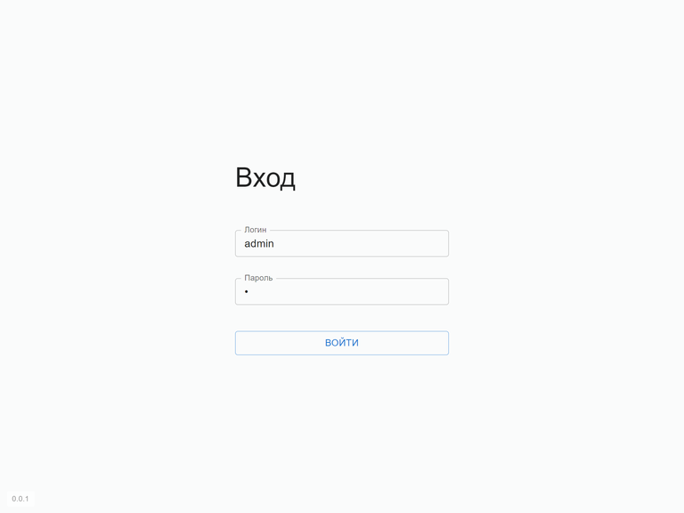

# Тестовое задание на позицию Frontend разработчика
## Краткое описание

Необходимо создать SPA приложение Личного кабинета (ЛК) реализующее следующую функциональность:

- вход пользователя в ЛК;
- для пользователя с ролью _admin_ отображение списка пользователей с возможностью действий над ними (создание, изменение, удаление);
- для пользователя с ролью _manager_ отображение личной страницы пользователя с дополнительной информацией полученной из стороннего API;
- для всех типов вошедших пользователей возможность выхода из ЛК с возвратом к странице входа.

## Ссылки
- [Описание сервиса API](backend/README.md)
- [Описание API](backend/docs/fe-test-task-api.yaml) в формате OpenAPI v3

## Требования
1. Для написания использовать один из js-фреймворков, желательно [React](https://react.dev/), и язык [TypeScript](https://www.typescriptlang.org/). 
2. Взаимодействие с сервисом бэкенда осуществляется с использованием REST архитектуры. В качестве бэкенда для SPA можно или использовать прилагаемый [сервис API](backend/README.md), или создать свой аналогичный с REST архитектурой в рамках Node.js (будет существенным плюсом). 
3. В качестве библиотеки компонентов использовать [MaterialUI](https://mui.com/material-ui/getting-started/) или что-то подобное.
4. Темизация защищенных страниц (требующих входа пользователя) должна отличаться от публичных страниц.
5. Для всех форм необходима валидация на стороне SPA плюсом к ошибкам возвращаемым из API. 
5. Плюсом будет использование современных технологий (сборщики, компоненты проекта).
6. Плюсом будет написание тестов.
7. Плюсом будет внедрение переключения визуальной темы SPA (день/ночь).
8. Плюсом будет создание адаптивной верстки вплоть до мобильных разрешений.
9. Код по возможности выложить на [github](https://github.com/).

## Описание страниц
### Вход
Страница содержит форму логина с полями логин и пароль и кнопкой входа. 
В случае успешного входа пользователь в зависимости от его роли попадает на соответствующую следующую страницу.

### Пользователи
Страница отображает таблицу существующих в системе пользователей. Есть возможность создавать новых, изменять и удалять текущих. Для удаления необходимо запрашивать подтверждение.

### Личная страница пользователя
Необходимо отобразить информацию о текущем пользователе.

Дополнительно необходимо отобразить информацию о погоде привязанную к текущим географическим координатам пользователя. 
Для этого например можно использовать [публичное API](https://sunrisesunset.io/api/) отдающие информацию о закате/рассвете в зависимости от координат или любое другое аналогичное этому.

